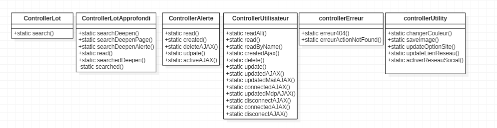
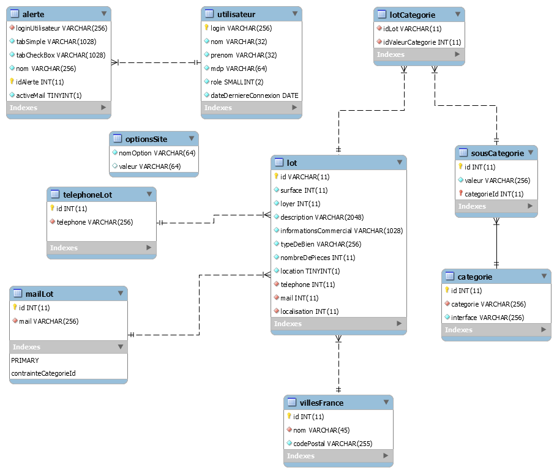

# Présentation général du fonctionnement du site

Il est développé selon le design pattern MVC.

## Présentation du modèle MVC

Quelques diagrammes pour présenter le fonctionnement global du pattern

### Fonctionnement global du MVC 

### En diagramme de séquence

## Présentation de la structure du site
Les diagrammes suivants sont sujets à être modifié

### Diagramme de classe des models

### Diagramme de classe des controllers

## Base de données 

